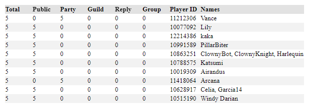

Get some basic statistics from your PSO2 chat log files, including a player's message counts for each chat.

Visit the site at: https://elekester.github.io/PSO2-Chat-Log-Statistics/

# PSO2 Chat Log Statistics User Manual

## File Upload and Settings Menu

When you first get started you'll see the below box with the file uploads and settings to choose from with an empty output below.


### 1. Chat Log Files Upload

You may select any number of files in the log or log_ngs folders in your PSO2 documents directory (same place that PSO2 stores native screenshots) to upload here. Files that aren't chat logs or symbol chat logs are simply skipped.


### 3. Player ID Filter File Upload

The Player ID filter file is a plain text document containing numerical Player IDs separated by a new line, tab, or comma. The resutls are limited to just those players who have those Player IDs.

```
11212306,10077092,  10991589
12214386
```

### 3. Name Filter File Upload

The name filter file is a plain text document containing names separated by a new line, tab, or comma. The results are limited to just those players who have a Player ID Name or Character Name in the filter.

```
ElekesterPrime,Nel, Elekester
Nett
```

Uploading more chat log files will increase the likelihood of the name filter catching players who use multiple characters with unknown names, but may increase the time required to perform calculations.

### 4. Name Filter Sensitivity

You can specify a sensitivity setting to allow for spelling errors in the name. The setting ranges from 0, which will accept all names as equivalent, to 100, which will only count exact spelling.

At 50 for example, Nel and Neol are treated as the same name, while at 80 they'd be two different names.

### 5. Message Filter

You can filter by message content. Only messages containing the given case-insensitive text will be included in the calculation. Alternatively you can set the message filter using a regular expression (will not work on Safari).

### 6. Date Filter

The results may also be filtered by message date. By default this is set to only include messages from the past four weeks, but can be set to as early as PSO2's launch date.

### 7. Calculate Button

Hit this button to calculate the statistics for the uploaded chat logs with the given filters. The results will be displayed below in the Output, unsorted.

## Output Table

Your data will be displayed in a table like the example below. Clicking on a header will sort the table by that column. Clicking it again will reverse the sort.



The column names are derived from the internal names for each of the chats.

* The Total column displays the total message count for each player.
* The Public column displays the Area message count for each player.
* The Party column displays the Party message count for each player.
* The Guild column displays the Alliance Message Count for each player.
* The Reply column displays the Whisper Message Count for each player.
* The Group column displays the Group Message Count for each player.
* The Player ID column displays the unique number associated to each player's account.
* The Names column displays the Player Names and Character Names associated to each player's account.
