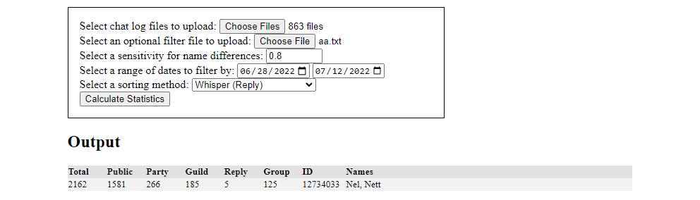
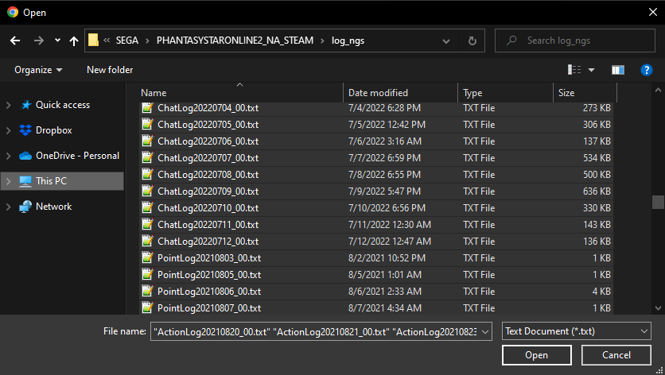

# PSO2 Chat Log Statistics

Get some basic statistics from your chat log files.

When you first get started you'll see the below box with the file uploads and settings to choose from with an empty output below. The statistics outputed are message counts in each of the chats, Player ID, and names associated with the Player ID.



You can simply select all the files in your PSO2's log or log_ngs folders for your chat logs.



The filter file will look something like this, with a list of names that are comma, tab, or newline separated. The results will be filtered by players with names on this list. The sensitivity setting allows for names to not be an exact match in case your worried about misspellings.

```
ElekesterPrime,Nel
Nett
```

You can also filter the logs by date of the messages and sort the data.
