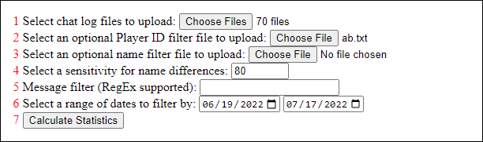
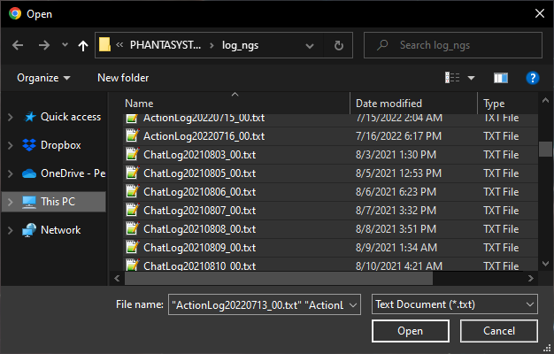

# PSO2 Chat Log Statistics

Get some basic statistics from your chat log files, like total message count or all the names used by a Player Id.

When you first get started you'll see the below box with the file uploads and settings to choose from with an empty output below.



1. You may select any number of files in the log or log_ngs folders in your PSO2 documents directory (same place that PSO2 stores native screenshots) to upload here. Files that aren't chat logs or symbol chat logs are simply skipped.
2. You can upload an optional name filter file here. More details on that below.
3. The sensitivity setting for the name filter. This is a number ranging from 0 to 100, where the higher a number chosen the more strict the name differences are allowed to be. At 50 for example, Nel and Neol are treated as the same name, while at 80 they'd be two different names.
4. A string of text (or RegEx) you can filter your messages by. At the moment this uses lookbehinds so Safari isn't supported when using Regular Expressions.
5. You can select a date range and only messages from within the range (inclusive) will be counted for the statistics.
6. Hit this button to calculate everything.

You can simply select all the files in your PSO2's log or log_ngs folders for your chat logs.



The filter file will look something like this, with a list of names that are comma, tab, or newline separated. The results will be filtered by players with names on this list. The sensitivity setting allows for names to not be an exact match in case your worried about misspellings.

```
ElekesterPrime,Nel
Nett
```

You can also filter the logs by date of the messages and sort the data.
